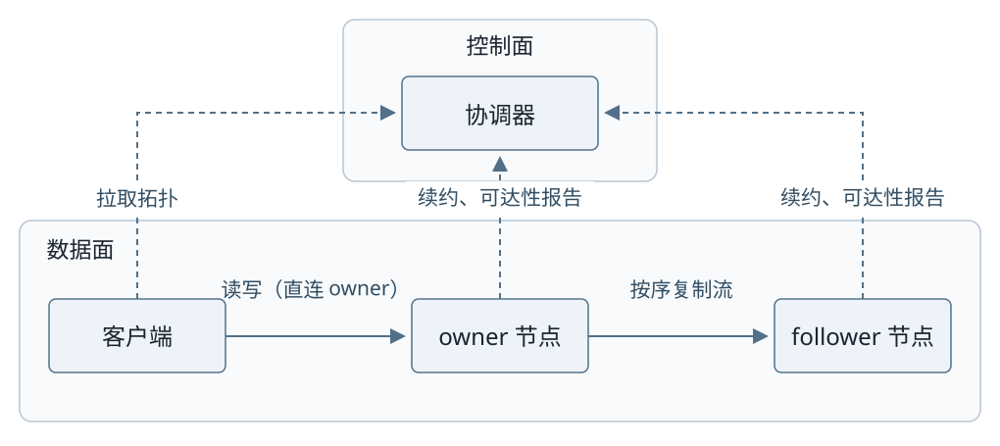

# Reports

[preliminary-report.md](preliminary-report.md) is the preliminary technical report.
[related-work.md](related-work.md) and
[implementation-and-verification.md](implementation-and-verification.md) contain
supporting material.

## Build the PDF

From this directory:

```sh
make pdf
```

The PDF is written to `build/preliminary-report.pdf`. The build directory also
contains generated LaTeX, rasterized figures, and compilation logs, all ignored
by Git. The Desktop PDF used during layout review is not a build dependency.

Requirements:

- Python 3 (standard library only)
- Pandoc 3 or newer and XeLaTeX with CTeX, `needspace`, and the standard Pandoc
  LaTeX packages
- Source Han Serif SC and JetBrains Mono fonts
- Chrome/Chromium, or `rsvg-convert`, for SVG figures. Set `REPORT_BROWSER` to
  the browser executable if it is not found automatically. An isolated headless
  profile under `build/` is used; your interactive browser profile is untouched.
- Noto Sans SC for the architecture SVG and a Chinese sans-serif font such as
  PingFang SC or Noto Sans SC for the ring SVG

The shared style in `rendering/` is adapted from the personal Pandoc CTeX report
template. It uses A4, 2 cm margins, 11 pt body text, 1.2 line spacing, a bold
compact title, and additional space around image/caption groups. Tables use
smaller type; headings and short tables reserve space before page breaks.

## Reuse for the final report

The pipeline accepts any report path and does not depend on preliminary-report
wording or figure numbers:

```sh
make pdf INPUT=final-report.md
# From the repository root, or for another report location:
python3 docs/report/rendering/build.py path/to/report.md --output path/to/report.pdf
```

Keep the title in YAML front matter. A trailing backslash creates a title line
break. Body headings start at `##`; Pandoc promotes them one level for the PDF.
Headings already contain their numbering, so automatic numbering is disabled.
Use `{.page-break}` on a heading when it should begin a new page.

Use standalone Markdown images with their complete caption as the alt text:

```md
{width=86%}
```

The same caption serves the Markdown view and PDF. The rendering filter keeps
the image and caption together. Figure numbering and explanations belong in the
report, while typography belongs in the shared rendering files.

Pandoc citations are supported through `--citeproc`. A later report can set its
own `bibliography` and `csl` in YAML; relative paths resolve beside that report.

## Figure sources

- `assets/gen_ring_example.py` regenerates the transparent `ring-example.svg`:
  run `make figures` after editing it.
- `assets/architecture.svg` is the approved, manually laid-out vector drawing.
  `assets/architecture.mmd` records its Mermaid graph structure; it is not an
  exact layout generator for the SVG. Keep the two consistent when changing the
  architecture.

Generated PDFs are local build outputs. The report sources, vector figures, and
rendering files are the files to version.
