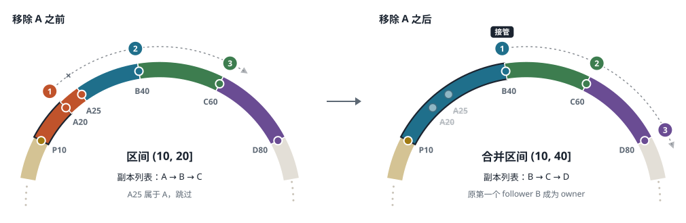

## 一、项目背景与目标

### 1.1 要解决的问题

单机内存缓存结构简单、延迟低，但随着业务规模增长，会遇到三个难以回避的限制。

第一是容量与吞吐。缓存数据全部放在内存中，单台机器的内存和处理能力都有上限，无法随业务量线性增长。

第二是可用性。单个缓存进程一旦崩溃，它保存的全部数据立即不可访问；即使进程很快重启，缓存也要从空状态重新预热。在这段时间里，原本由缓存承担的请求会直接落到后端存储上，可能把后端压垮。

第三是扩缩容代价。若用 `hash(key) mod N` 这类方式把数据分到多台机器，节点数一变，绝大多数键的归属都会改变，扩缩容几乎等同于整体失效；而迁移过程又与在线流量相互干扰。

缓存数据有一个与数据库不同的特点：它通常可以从后端数据源重新生成。这意味着缓存不必承担磁盘持久化、事务和强一致多副本协议的成本；但另一方面，缓存也不能因为一个节点故障就整体不可用，否则后端会被穿透，系统整体可用性反而比不用缓存时更差。

基于以上考虑，本项目的目标是实现一个**多进程的分布式内存缓存**：数据按一致性哈希分布到多个节点上，支持在线扩缩容；每段数据保存多个副本，节点故障时能自动转移；写入确认的严格程度做成可配置的集群策略，由使用者在写入延迟和故障时的数据保留之间显式取舍。

### 1.2 应用场景

本系统面向以下几类场景：

- 作为业务系统的缓存层，存放会话、对象元数据、聚合查询结果等可从后端重建的热点数据；
- 在负载随时间变化的环境中按需增减节点，扩缩容期间缓存持续提供服务；
- 单个节点崩溃后自动完成故障转移，在数秒内恢复读取，写入按所选确认策略恢复；
- 在不同部署形态下使用同一套接口。节点之间只通过带版本的 gRPC 接口通信，同一个客户端既可以连接本机多进程集群，也可以连接容器、虚拟机或远程主机上的集群。

### 1.3 项目范围

本项目实现的内容包括：基于虚拟节点的一致性哈希路由；按区间复制、复制因子可配置的多副本机制；三种具名写入确认策略（`OwnerOnly`、`FirstSuccessor`、`AllReplicas`）和写入可用性门槛；节点租约与基于进程实例的隔离（fencing）；故障检测、确认、自动摘除、确定性接管和后台副本修复；在线扩容、缩容，以及复制因子和确认策略的在线变更；基于 mutation ID 的请求去重，以及区分“确定未执行”和“可能已执行”的错误语义；可复现的真实多进程实验运行器。

以下内容不在本项目范围内：数据的磁盘持久化；协调器自身的高可用；跨故障切换的线性一致性；跨数据中心部署；按请求覆盖集群级确认策略。

### 1.4 项目进展与规模

项目的实际进度已经超出初期调研阶段；截至目前，项目已经完成了基本读写、拓扑变更的持久化、在线迁移、多副本复制、故障转移，以及一些压测和性能优化。此后的工作集中在验证实验、性能分析与进一步优化、文档编写上。

系统用 Rust 实现。`crates/` 目录下共约 1.7 万行代码，其中约 3,600 行是 crate 内的测试文件；另有约 3,200 行真实进程集成测试（`tests/`）和约 670 行命令行入口（`src/main.rs`）。

代码按职责分为五个 crate：`hashring-core`（protobuf 协议、拓扑与迁移的领域类型、协议上限）、`hashring-client`（路由、截止时间、重试与错误语义）、`hashring-coordinator`（持久化集群状态与变更编排）、`hashring-node`（内存记录、复制流、迁移暂存与数据节点服务）和 `hashring-experiment`（真实多进程实验与证据记录）。客户端、协调器和数据节点只依赖 `hashring-core`，彼此之间没有依赖。

根目录是一个可执行程序，通过子命令提供全部角色：`coordinator` 和 `node` 启动服务进程；`put`、`get`、`delete` 执行读写；`topology`、`replica-status`、`change-status` 查询集群状态；`begin-change`、`begin-policy-change`、`begin-config-change` 和 `execute-change` 发起并执行成员与配置变更；`experiment` 运行可复现实验。

## 二、相关技术调研

一致性哈希只回答“一个键大致应该放在哪个节点上”。一个能在线扩缩容、能容忍节点故障的缓存系统，还需要回答更多问题：客户端如何找到键所在的节点；“集群有哪些节点、每段数据归谁”这份信息由谁维护；扩缩容时数据迁移与在线读写如何共存；数据保存几份、写入何时算成功、节点故障后由谁接管。本章以 Redis Cluster、Apache Cassandra 和 ScyllaDB 为主要参照，依次讨论数据分布、请求路由与拓扑管理、在线迁移、数据复制与故障恢复四个方面，最后给出本项目的选型结论。Redis Cluster 是分布式缓存的直接参照；Cassandra 和 ScyllaDB 是分布式数据库，但它们的 token 环与本项目的一致性哈希路线最为接近。

需要说明一个术语差异：在 Cassandra 和 ScyllaDB 中，coordinator 指“接收本次请求并把它转发给副本的那个普通节点”，是每个请求临时承担的角色；本项目中的协调器是一个独立的控制面服务，负责管理拓扑，不处理普通读写。

### 2.1 数据分布：取模、固定槽位与一致性哈希

最直接的分片方法是 `node = hash(key) mod N`。它的问题在于节点数一变，大部分键的取模结果都会改变：在哈希均匀的条件下，从 N 个节点扩到 N+1 个，约 N/(N+1) 的键需要更换节点，例如从 4 个节点扩到 5 个，约 80% 的键要迁移。对缓存而言，这几乎等于一次整体失效。因此，工业系统通常在键和节点之间加一层**逻辑分片**：键先映射到一个稳定的逻辑分片，再由拓扑决定分片归哪个节点。节点增减时只改派一部分分片，其余键的位置不变。各系统的区别主要在于逻辑分片的形式。

**固定槽位。** Redis Cluster 把键空间固定分为 16384 个 hash slot，`HASH_SLOT = CRC16(key) mod 16384`，每个 master 负责一部分 slot。slot 的数量和边界永远不变，扩缩容时变化的只是 slot 到节点的映射。这种方式的映射表小、直观，迁移单位明确；代价是分片粒度固定，负载均衡依赖运维或工具在节点之间搬移 slot。([Redis Cluster Specification](https://redis.io/docs/latest/operate/oss_and_stack/reference/cluster-spec/))

**一致性哈希环与虚拟节点。** Cassandra 把哈希值空间首尾相连成一个环，每个节点在环上占据若干位置（token），每个 token 负责它与前一个 token 之间的区间，键顺时针遇到的第一个 token 所属的节点即为 owner。新增节点时只需从相邻节点接过一部分区间；在节点权重相同的情况下，平均只有约 1/(N+1) 的键需要迁移，迁移量与变更规模成比例。若每个物理节点只有一个 token，各节点分到的区间长度可能差别很大，因此 Cassandra 让每个物理节点占据多个 token（虚拟节点，vnode），区间被切得更细，新节点加入时会从许多节点各接过一小段。Cassandra 文档同时指出了 vnode 的代价：token 越多，一个节点在环上的邻居越多，多个节点同时故障时，某段数据的全部副本恰好都落在故障节点上的可能性越大。([Cassandra: Dynamo](https://cassandra.apache.org/doc/latest/cassandra/architecture/dynamo.html))

**动态分片。** ScyllaDB 继承了 Cassandra 的 token 环，但新建 keyspace 默认改用 tablets：表被切成多个 tablet，每个 tablet 有独立的副本位置，可以单独迁移，数据增多时还可以分裂。这说明逻辑分片本身也可以成为被动态管理的对象，代价是需要一套更复杂的分片元数据管理和负载均衡机制。([ScyllaDB: Tablets](https://docs.scylladb.com/manual/stable/architecture/tablets.html))

### 2.2 请求路由与拓扑管理

确定了“键到分片、分片到节点”的映射后，还要决定由谁执行这个映射，以及这份映射由谁维护。这是两个相互独立的问题。

在请求路由上，常见做法有三种。第一种是**代理**：客户端把请求发给代理层，由代理按分片规则转发，Twemproxy 是这类方案的代表。客户端无需改造，但每个请求多一跳网络，代理本身也需要高可用和扩容。第二种是**节点转发**：Cassandra 的客户端可以把请求发给任意节点，收到请求的节点计算副本位置并转发，客户端实现简单，但可能多一跳；实际使用中，Cassandra 驱动通常会感知 token 分布，尽量直接把请求发给持有副本的节点。第三种是**客户端路由**：Redis Cluster 的节点不代理请求，客户端缓存 slot 到节点的映射，自行计算并直连目标 master；映射过时导致请求发错节点时，节点返回 `MOVED`，客户端更新映射后重试。客户端路由的数据路径最短，代价是客户端要缓存拓扑并正确处理拓扑变化。

在拓扑管理上，Redis Cluster 和当前 GA 版本的 Cassandra 都采用去中心化的 **gossip**：节点之间两两交换成员、故障判断和分片归属信息，信息逐步扩散到全体节点。Redis 用 `currentEpoch` 和 `configEpoch` 解决节点间暂时冲突的配置，epoch 大者胜出。gossip 没有单点，但难以保证所有节点按相同顺序看到拓扑变更，例如两个节点同时加入时，可能各自依据不同的拓扑开始搬数据。近年的趋势是改为**集中定序**：由一个统一的权威为所有拓扑变更确定唯一的先后顺序，并为每个变更分配递增的版本号，各节点严格按这一顺序逐个应用，不会跳过，也不会颠倒。ScyllaDB 已经用 Raft 管理拓扑，每个拓扑操作先写入多数节点认可的日志，再按日志顺序执行，官方文档指出这使多个节点可以并发 bootstrap ([ScyllaDB: Raft](https://docs.scylladb.com/manual/stable/architecture/raft.html))；Cassandra 的 [CEP-21 Transactional Cluster Metadata](https://cwiki.apache.org/confluence/display/CASSANDRA/CEP-21:+Transactional+Cluster+Metadata) 也计划把拓扑和 token 归属从 gossip 移到带 epoch 的有序元数据日志中。

这里的“集中”指顺序由一处统一决定，而不是指物理上只有一台服务器：ScyllaDB 的 Raft 日志复制在多个数据节点之间，但它们共同产生的仍是同一个变更序列。这一机制只处理低频的拓扑变更，不处理每次读写。由此可以得到一个对本项目很重要的结论：数据面去中心化并不要求控制面也去中心化。拓扑变更频率低但要求严格有序，适合集中定序；需要避免的是控制面进入读写路径而成为瓶颈。

### 2.3 在线扩缩容中的数据迁移

一致性哈希能算出扩缩容后哪些区间应当换 owner，但没有回答迁移过程本身的问题。设区间 R 要从节点 A 迁到节点 B。如果先复制数据再切换归属，那么某个键被复制之后、切换之前写入 A 的新值不会出现在 B 上，切换后这次写入就丢失了；如果先切换归属再复制，B 在复制完成前缺少数据，读请求会看到本不该出现的“键不存在”。在线迁移因此必须解决两件事：复制期间的新写入如何同步到目标，以及在什么时刻切换归属是安全的。

Redis Cluster 的传统方式是显式的中间状态：源节点把 slot 标记为 `MIGRATING`，目标节点标记为 `IMPORTING`，然后逐批移动键。迁移期间，键仍在源节点上时由源节点处理；已被移走的键，源节点返回 `ASK`，客户端仅把这一次请求转到目标节点，不更新映射。全部键迁完后 slot 才正式归属目标节点。这种方式不要求一次性复制完成，但客户端必须处理 `ASK`，涉及多个键的命令在键被拆散于两个节点时也会失败。Redis 8.4 引入的原子 slot 迁移改为整体复制：源节点发送 slot 快照，同时通过另一条连接实时发送迁移期间的增量写入；快照发完、增量积压降到阈值以下后，源节点短暂暂停客户端写入，发完剩余增量，再由目标节点接管 slot 并广播新配置，客户端在迁移过程中不会收到 `ASK`。([Atomic slot migration with Redis 8.4](https://redis.io/blog/atomic-slot-migration/))

Cassandra 的新节点在 bootstrap 时先分配 token，再从现有副本流式拉取将要负责的区间。旧节点不会自动删除已移出的数据，需要运维之后执行 `nodetool cleanup`；迁移期间遗漏的写入依靠 hinted handoff 和 repair 补齐。([Cassandra: Topology Changes](https://cassandra.apache.org/doc/latest/cassandra/managing/operating/topo_changes.html)) ScyllaDB 的 tablets 则由负载均衡器在后台逐个迁移，拓扑更新由 Raft 保证一致，每次只搬一小块，出错时影响范围也小。

归纳起来，在线迁移有三类基本机制。**停写整体复制**最容易证明正确，但停写时间随数据量增长，不能算在线迁移。**双写**让迁移期间的每次写入同时写源和目标，看似简单，实际上把迁移逻辑带进了正常写路径：写源成功而写目标失败时如何处理、双写的起止时刻如何与快照扫描和切换对齐、同一个键的并发写入在两端的到达顺序是否一致，都难以处理好。**快照加增量**先在后台复制大部分数据，期间的新写入记入日志后按序回放，最后只对尾部短暂停写、校验一致后切换。它的关键约束是必须先开始记录增量、再开始扫描快照；顺序颠倒时，某个键可能已被快照扫过而其后续修改尚未开始记录，这次修改就会丢失。切换之后，新 epoch 的拓扑是判断归属的唯一依据，旧 owner 即使还保留数据，也不能再用来回答请求。

### 2.4 数据复制与故障恢复

保存多个副本是高可用的前提，但副本之间如何同步、写入何时算成功、故障后以谁为准，工业系统主要有两条路线。

**主从复制（primary/replica）。** Redis Cluster 中每个 slot 有一个 master 接受写入，replica 从 master 异步复制：master 执行完写入就回复客户端，之后再把写入发给 replica。master 被多数 master 判定失联后，它的一个 replica 发起选举，获得多数 master 投票后提升为新 master，并以更大的 `configEpoch` 宣告对这些 slot 的所有权。异步复制意味着存在丢失已确认写入的窗口：master 回复成功后、写入发到 replica 之前宕机，被提升的 replica 上就没有这次写入。Redis 提供 `WAIT` 命令等待指定数量的 replica 收到写入，但官方文档说明它不能使 Redis 成为强一致存储，因为故障切换时被选中的 replica 不一定是收到了该写入的那一个。([WAIT](https://redis.io/docs/latest/commands/wait/))

**无主 quorum。** Cassandra 和 ScyllaDB 中一个分区的多个副本地位对等，没有固定的写入者。请求的 coordinator 把写入发给全部副本，并按一致性级别决定等待多少个副本确认：`ONE` 只等一个，`QUORUM` 等多数，`ALL` 等全部。若写入等待 W 个副本、读取询问 R 个副本且 W + R > RF，读到的副本中至少有一个参与过写入。这种设计的好处是单个副本故障时无需选举，剩余副本数量足够即可继续服务，一致性级别也可逐个请求调整；代价是副本会暂时不一致，需要额外机制收敛：并发写入以时间戳最新者为准（last-write-wins），因而依赖时钟大致同步；写入时不在线的副本由其他节点暂存提示（hint），待其恢复后补发（hinted handoff）；读取时发现不一致则顺便修正（read repair）；后台定期用 Merkle 树比较并修复副本差异（anti-entropy repair）。([ScyllaDB: Fault Tolerance](https://docs.scylladb.com/manual/stable/architecture/architecture-fault-tolerance.html))

主从路线还要面对无主路线所没有的**脑裂**问题。如果旧 owner 没有宕机，只是与集群其他部分的网络断开，集群会提升新 owner，而旧 owner 仍可能被部分客户端访问并继续接受写入，两边的写入必有一边丢失。解决办法统称为 fencing，即保证旧 owner 在新 owner 生效之前已经停止服务。常用手段有两种：一是让请求和复制消息携带拓扑版本（epoch），节点拒绝旧 epoch 的指令；二是租约（lease），owner 的服务权限有时限，必须定期续期，续不上就在租约到期时自行停止服务，控制面只要等到旧租约确定过期，就可以安全地启用新 owner。Redis Cluster 的做法与租约思路相近：master 与多数 master 失联超过 `NODE_TIMEOUT` 后拒绝写入，以限制少数派一侧接受写入的时间。

| | 主从复制 | 无主 quorum |
| --- | --- | --- |
| 写入顺序 | 由唯一 owner 决定，易于定义单调序号、请求去重和单键线性一致 | 多副本可并发写入，需要时间戳和冲突裁决 |
| 单节点故障 | 需要检测故障、提升副本、隔离旧 owner，期间该分片短暂不可写 | 剩余副本数量足够时无需切换 |
| 数据丢失风险 | 异步确认时存在丢失已确认写入的窗口 | 取决于读写一致性级别 |
| 恢复方式 | 补齐副本数量 | 持续依赖 repair 使副本收敛 |
| 主要难点 | 提升哪个副本、如何隔离旧 owner | 副本如何收敛、冲突如何裁决 |

### 2.5 调研结论与选型

上述系统说明，分片方式、请求路由、拓扑管理和复制模型是可以分别选择的几个维度：Redis Cluster 采用固定槽位、客户端路由、gossip 和异步主从复制，数据路径最短，但拓扑协议、故障选举和客户端重定向都比较复杂；Cassandra 采用 token 环、节点转发、gossip 和无主 quorum，单副本故障无需切换，但副本收敛和冲突裁决成为系统的重要组成部分；ScyllaDB 保留了 Cassandra 的数据面，而用 tablets 和 Raft 管理数据分布和拓扑。结合本项目“客户端直连、在线扩缩容、一致性边界明确”的目标，本项目在各维度上的选择如下。

1. **数据分布采用一致性哈希加虚拟节点。** 迁移量与变更规模成比例，不需要额外维护一层槽位分配和再平衡逻辑。更重要的是，虚拟节点使一个节点的区间分散在环上许多位置，节点离开后这些区间会分别并入多个不同的后继节点，而不是全部压到一个邻居身上，这一点是第三章故障接管设计的基础。
2. **请求采用客户端路由。** 与 Redis Cluster 一样，客户端缓存拓扑并直接访问 owner，正常读写不经过额外一跳。不同的是，协调器下发的是包含全部 token 分配的完整拓扑，客户端不必自行重建环，避免了不同客户端因实现或配置差异算出不同的环。
3. **拓扑变更由独立的协调器集中定序。** 参照 ScyllaDB 和 Cassandra 集中定序拓扑变更的方向，由一个独立的协调器维护权威拓扑和 epoch，负责成员变更、迁移切换和故障接管，但不参与正常读写。与在数据节点间运行 Raft 相比，单实例协调器的实现要简单得多；代价是协调器自身的高可用不在本项目范围内。
4. **复制采用单 owner 的主从模型。** 每个区间由唯一 owner 决定写入顺序，序号、请求去重和迁移切换都容易定义。在此基础上，本项目用租约和 epoch 隔离旧 owner，并提供可配置的写入确认策略。默认策略只等 owner 应用，与 Redis 异步复制有相同的丢失窗口；也可以要求“故障时将被提升的那个副本”先确认，从而在单节点故障时不丢失已确认的写入。这一点与 Redis `WAIT` 不同：`WAIT` 只保证“某些副本”收到写入，而故障切换时未必选中它们。
5. **迁移采用快照加增量。** 思路与 Redis 8.4 原子迁移相近：先开始记录增量，再复制快照并回放增量，最后对迁移中的区间短暂停写、校验一致后发布新 epoch。

本项目没有选择无主 quorum，主要原因是系统已经有客户端路由和区间 owner 的概念，保留单一 owner 能让写入顺序、迁移切换和一致性契约都更容易定义；同时通过 follower、确认策略、租约和 epoch，可以缩小最简单的异步主从方案的数据丢失窗口。

## 三、总体方案设计

### 3.1 设计目标与总体架构

根据第一章的问题和第二章的调研，方案设计围绕四个目标展开：节点可以在线增减，迁移期间缓存持续服务；单个节点故障后系统自动恢复服务，并且恢复过程中的行为可以预期；写入确认的代价和它提供的保护程度可以选择，语义清楚；负责协调的组件不进入读写路径，不成为性能瓶颈。

系统由客户端、数据节点和协调器三种角色组成，分为数据面和控制面两部分，如图 3-1 所示。

{width=86%}

数据面只包含客户端和数据节点。客户端缓存协调器下发的拓扑，自行算出键的 owner 并直接发送请求；owner 在内存中应用变更，再通过按序复制流把变更发给 follower。follower 只接收复制，不响应普通读请求。

控制面由单实例的协调器承担。它串行执行所有拓扑变更并为其分配 epoch，向节点发放租约，持久记录副本是否就绪，并在节点故障时执行接管。协调器不处理任何读写请求。它不可用时，已有拓扑下的读写在节点租约有效期内照常进行；租约到期后，节点因无法续约而自行停止服务。这样，协调器故障的后果是“停止服务”，而不是“在错误的拓扑下继续服务”。

### 3.2 数据分布与副本放置

键经带种子的 xxh3-64 哈希映射到 64 位环上。每个物理节点默认占据 128 个 token，每个 token 负责区间 `(前一个 token, 本 token]`，10 个节点时环上共有 1,280 个区间。区间没有永久编号：加入节点会插入 token、切开区间，删除节点会移除 token、合并区间。协调器下发的拓扑包含全部 token 分配，因此所有客户端和节点算出的环完全相同。

一个区间的副本列表由环直接推导：从区间末端 token 所属的节点（owner）出发沿环顺时针前进，依次加入尚未出现在列表中的物理节点，直到列表长度达到复制因子（默认 RF=3）。owner 之后的节点依次称为第一个 follower、第二个 follower。系统不维护单独的副本放置表，也不允许人工指定副本位置。

这一规则带来了整个方案最重要的性质：**区间的第一个 follower，正是 owner 被移除后环会选出的新 owner。** 两者都是“从该区间顺时针走、跳过原 owner 的 token 后遇到的第一个节点”。图 3-2 给出了一个例子。

{width=94%}

图中，色带表示区间的 owner，编号表示从区间末端顺时针收集副本的顺序，× 表示跳过已在列表中的物理节点。移除前，区间 (10, 20] 从 token A20 开始收集副本；A25 同属节点 A，因而被跳过，副本列表为 A、B、C。(20, 25] 的副本列表相同，(25, 40] 的副本列表为 B、C、D。节点 A 的 token 删除后，这三个区间合并为 (10, 40]，副本列表变为 B、C、D，原来的第一个 follower B 成为 owner。

更一般地，移除一个节点只会让每个副本列表删去该节点、其余节点前移一位，再在末尾补上一个新节点。前移的节点本来就持有数据，缺数据的只有末尾新补的那一个。因此，缩容和故障接管都不需要在关键路径上搬运整段数据，接管者也不需要选举，由环直接确定。虚拟节点则使一个节点的区间分散在环上许多位置，节点离开后，这些区间会分别并入多个不同的后继节点，负载不会集中到一个邻居身上。

不过，环只确定了接管者是谁，并不能说明接管者确实持有完整的数据。follower 可能刚加入、初始复制尚未完成，或者复制流中断过。接管者的数据是否完整，由下一节的准入记录证明。

### 3.3 副本机制

**期望副本与已准入副本。** 系统区分“副本应该在哪里”和“副本是否已经就绪”。前者由已提交拓扑回答。拓扑包含 epoch、成员与 token 分配、复制因子、确认策略和写入可用性门槛，并附带对规范编码计算的 BLAKE3 摘要，接收方据此校验内容是否一致；其中任何一项发生变化，都要产生新的 epoch。后者由协调器持久保存的准入记录回答。一个 follower 只有在初始快照和其后连续的增量都经过校验之后，才会获得一条准入记录，记录绑定 epoch、精确的区间边界、节点和进程实例。只有已准入的 follower 才能计入写入确认，或在故障时被提升。准入状态的变化不推进 epoch，因此副本修复的进度对客户端不可见，不会引起路由刷新。

**写入路径。** owner 处理一次 PUT 或 DELETE 的过程是：

1. 校验键的归属、拓扑 epoch 和自身租约，确认区间未处于迁移暂停状态，并检查写入可用性门槛和确认策略所需的 follower 是否就绪；
2. 查询去重收据，已执行过的请求直接返回原结果；检查内存预算，不足时在应用之前返回可重试的背压错误；
3. 分配 owner 序号，在本地应用变更，并为全部期望 follower 生成复制条目；
4. 只等待确认策略要求的 follower 应用这次变更，然后返回记录版本；其余 follower 的复制在后台继续。

复制条目发给所有期望 follower，而准入只决定 follower 能否计入确认。follower 在校验 epoch、owner、序号并在本地应用之后才回复确认，仅仅收到或入队不算确认。写入可用性门槛则是写入前的就绪检查，它要求至少有若干份已准入副本（owner 自身计为一份），以及若干个滞后不超过阈值的健康 follower。默认门槛只要求 owner 本身，因此持有有效租约的 owner 即可写入。调高门槛是用可用性换取更低的丢失风险，但门槛本身不是持久性承诺。

**确认策略。** 确认策略是集群级配置，采用具名枚举：

| 策略 | 何时确认写入 | 故障时的行为 |
| --- | --- | --- |
| `OwnerOnly`（默认） | owner 已应用 | owner 崩溃时，尚未被接管者应用的已确认写入可能丢失 |
| `FirstSuccessor` | owner 和第一个 follower 均已应用 | 从健康状态出发，单节点故障不丢失已确认的写入 |
| `AllReplicas` | 全部期望副本均已应用 | 副本不足或未就绪时，写入以可重试错误失败 |

不采用 Cassandra 式的数字 quorum，是因为接管者是确定的。设 RF=3，owner 为 A，follower 依次为 B、C。若“任意两份确认”即算成功，A 和 C 确认后 A 崩溃，被提升的却是 B，这次写入仍会丢失。只有接管者 B 的确认对故障转移有意义，`FirstSuccessor` 要求的正是这一份确认。由于数据只在内存中，这里的“确认”指已应用到内存。在同一个 owner 任期内，单键读写由唯一 owner 定序；跨故障切换时，系统只提供上表所述的保证，不保证线性一致。

**幂等与错误语义。** 记录版本 `(epoch, owner 序号, owner)` 为变更定序，每条复制流另有连续的流序号，follower 据此发现缺口；出现缺口时，副本通过修复流程重新建立，不会跳过缺失的变更。客户端为每次逻辑写入生成 mutation ID，所有重试复用同一个 ID。owner 把对应的去重收据保留 60 秒，收据随复制流发给 follower，迁移时随快照传给目标节点，所以迁移后的重试仍得到原结果。故障切换后的重试能否去重，取决于收据是否已经到达接管者：`OwnerOnly` 下，owner 可能在收据复制出去之前崩溃，此时重试会被当作新请求执行。错误响应同时说明两件事：这次尝试为什么失败，以及变更是否可能已经生效。客户端汇总一次逻辑操作的全部尝试，截止时间到达时，只有确知变更未执行才报告 `KnownNotApplied`，否则报告 `MayHaveApplied`；结果一旦变为不确定，就不会再改回确定。

### 3.4 在线扩缩容

成员变更由管理员提交目标成员列表，协调器持久保存后串行执行，同一时间只执行一个变更。受影响的区间被拆成独立的迁移任务并发执行，默认并发上限为 16。新 epoch 发布之前，变更可以中止；发布之后，只能继续向前完成。

**扩容**需要把数据复制到新节点，采用第二章所述的快照加增量方式：

1. 协调器计算目标拓扑，以及每个区间新的 owner 和 follower；
2. 源节点先为受影响区间开启变更日志，再导出快照。迁移期间源节点仍是 owner，继续处理读写，新的写入记入日志；
3. 目标节点导入快照（包括去重收据），并按顺序回放日志；
4. 切换时，受影响区间的写入短暂返回可重试的 `RangeBusy`，读取不受影响。协调器排空剩余日志，比较两端的记录数、日志水位和记录内容的 BLAKE3 摘要，一致后发布新拓扑、记录准入、恢复写入，最后清理旧副本。

**缩容**在目标拓扑只删除节点时走自然继承路径。根据 3.2 节的性质，离开节点的区间会并入原来的第一个 follower，而这个节点早已持有数据。数据节点把作为 owner 和作为 follower 持有的记录存放在同一张表中，所以“并入”只是拓扑归属的变化，不需要复制数据：

1. 确认每个合并区间的新 owner 都是各组成部分的原 owner 或第一个 follower；当前策略所需的 follower 若缺少准入，先在后台补齐；
2. 短暂暂停写入，等待复制流追平；
3. 再次确认覆盖关系和租约没有变化，然后发布新 epoch，已追平 follower 的准入记录直接带入新拓扑；
4. 恢复写入，清理多余副本，最后停止离开的节点。列表末尾新补的 follower 通过后台修复获得数据。

**策略与复制因子变更**同样是拓扑变更。收紧确认策略或提高门槛时，协调器先等新要求的 follower 准入并追平，再发布新 epoch。如果直接切换，新策略生效后的一段时间里，写入在名义上受保护，实际上并未受保护。目标策略在当前副本条件下无法满足时，变更中止，不会发布。

**副本修复**负责把副本补齐到期望的复制因子。修复目标由拓扑推导，无需另行选择；协调器从当前 owner 向缺少准入的 follower 复制快照并同步增量，校验通过后才写入准入记录。修复不改变 epoch，对客户端透明；任务状态保存在协调器中，协调器重启后可以继续。

### 3.5 故障检测与故障转移

**租约与隔离。** 本项目用租约实现隔离，不使用多数派投票。协调器按“节点、epoch”发放 5 秒租约，节点约每秒续约一次，并用单调时钟判断租约是否有效。GET、PUT 和 DELETE 都要求节点持有有效租约，因此续不上约的节点会在租约到期时自行停止服务。租约还绑定进程实例 ID：节点每次启动都生成新的 ID，协调器不接受一个已提交成员以新实例重新登记。这样，一个重启后内存为空的进程无法沿用旧身份，也就不会把“数据丢失”当作“键不存在”返回给客户端。

**故障确认。** 节点之间每秒互相探测，并把结果报告给协调器。目标节点的租约已经失效时，协调器直接确认故障；否则，需要至少两个持有有效租约的独立节点持续报告它不可达满 5 秒，才确认故障。只有一对节点之间互不可达时，网络分区中无法判断哪一方出了问题，协调器不驱逐任何一方，只在 `replica-status` 中把该节点标记为疑似故障。

**接管过程。** 故障确认后：

1. 协调器停止为故障节点续约，并等待它的租约确定过期。协调器自身重启后，也会先等待一个完整的租约周期，以覆盖重启前刚发放的租约；
2. 协调器证明覆盖关系：每个合并区间的新 owner，对每个组成部分要么原本就是 owner，要么是持有准入记录的第一个 follower。任何一部分不满足，就不发布新拓扑，相关区间保持不可用，不完整的副本不会被提升；
3. 协调器发布不含故障节点的新拓扑。新 owner 安装拓扑、取得租约后，立即用已有数据恢复读取；
4. 写入按确认策略恢复：`OwnerOnly` 立即恢复；`FirstSuccessor` 等新的第一个 follower 完成修复并准入；`AllReplicas` 等全部期望副本就绪。

故障路径无法确认旧复制流的末尾状态，因此当前实现在发布故障拓扑时会清空全部准入记录，所有区间的 follower 都要重新修复。所以，在 `FirstSuccessor` 和 `AllReplicas` 下，写入恢复前的暂时阻塞不限于故障节点原先负责的区间（改进方向见 5.2 节）。被摘除的节点即使重新启动，也只能作为新成员通过成员变更重新加入，像新节点一样经过复制和校验，才能重新承担 owner 或 follower 职责。

### 3.6 关键设计选择

以上机制建立在几项相互关联的取舍之上。

**一致性哈希，而不是固定槽位。** 固定槽位（2.1 节）的映射更直观，但需要单独的槽位分配和再平衡逻辑。一致性哈希的区间随拓扑自然切分与合并，而且副本放置规则本身就是接管计划，这是缩容和故障接管不需要搬运数据的前提。

**单一 owner 加具名确认策略，而不是无主 quorum。** 无主 quorum（2.4 节）在单副本故障时不需要切换，但需要冲突裁决和持续 repair。单一 owner 使写入顺序、请求去重和迁移切换都容易定义；代价是 owner 故障后有约一个租约周期的不可用时间，默认策略下还存在异步丢失窗口。具名策略让使用者可以明确选择是否用一次复制往返来关闭这个窗口。

**单实例协调器加租约，而不是 gossip 或节点间共识。** 集中定序（2.2 节）让拓扑变更严格有序，租约在不引入共识的前提下保证同一时刻只有一个 owner。代价是协调器自身没有高可用；它故障时，系统停止服务，而不是继续以错误的状态服务。

**依据覆盖证明提升副本，而不是挑选“最新”的副本。** 按滞后或版本挑选副本，一旦选中不完整的副本，就会造成静默的数据丢失。只认覆盖证明，把这类错误转化为显式的不可用。

**快照加增量与短暂停写，而不是双写。** 迁移逻辑不进入正常写路径，停写只覆盖最后一小段尾部，并且只影响正在迁移的区间（2.3 节）。

## 四、初步实现与验证

项目的主体功能已经实现，并在真实多进程集群上完成了功能、迁移、性能和故障恢复验证。本章先概述已实现的功能，再说明验证方法和主要结果，最后说明这些结果的适用范围。本章的实验均在单台开发机上运行，数据用于说明方案可行，不作为生产环境的性能或可靠性保证。

### 4.1 已实现的功能

第三章描述的机制均已实现，主要包括以下几部分。

**基本读写与客户端路由。** 系统支持任意字节串键值的 GET、PUT 和 DELETE，键最大 64 KiB，值最大 8 MiB。DELETE 是幂等的：成功表示操作完成后该键不存在，无论它之前是否存在。客户端缓存协调器下发的完整拓扑并直连 owner，拓扑过时时由 `Moved` 触发刷新重试。一次逻辑操作的所有尝试共用一个截止时间，命令行客户端默认为 2 秒，实验运行器默认为 30 秒。写请求携带 mutation ID，去重收据保留 60 秒，错误结果区分 `KnownNotApplied` 和 `MayHaveApplied`。

**在线扩缩容。** 扩容采用快照加增量迁移，切换时受影响区间的写入短暂返回 `RangeBusy`，读取不中断；缩容在条件满足时走自然继承路径，只需短暂停写、追平复制流并发布新拓扑。协调器的变更状态保存在 redb 中，重启后自动继续未完成的变更。

**复制、故障转移与副本修复。** 复制因子、三种确认策略和写入可用性门槛均可在线变更；follower 必须经快照复制、增量追平和校验后才会被准入；节点租约、进程实例隔离、故障确认、覆盖证明和确定性接管均已实现；故障后协调器在后台逐个区间修复副本，修复期间 `OwnerOnly` 的写入不受影响。

**可观测性。** `replica-status` 命令输出已提交的 epoch、摘要、期望复制因子和当前确认策略；对每个节点，输出进程实例、租约到期与最近续约时间、疑似故障与隔离状态、是否正在加入以及当前变更阶段；对每个区间，输出名义副本数 `current_rf`、持有租约的实际副本数 `live_rf`、owner 租约状态，各 follower 的准入、滞后、健康状态、复制序号和最近确认序号，区间是否可写及阻塞原因、是否欠复制，以及修复阶段、重试次数、下次尝试时间和最近一次错误。`current_rf` 是由拓扑推导的名义值，不能单独证明副本存活；在迁移切换的暂停阶段，区间会被保守地标记为不可写。

**实验运行器。** `experiment` 命令启动协调器和普通数据节点子进程，用同一个客户端库驱动负载，并把配置清单、JSON-lines 事件日志、各进程的标准输出与标准错误、协调器数据库和结果摘要写入新的结果目录；目录非空时拒绝运行，不会覆盖已有结果。清单记录实际配置、工具链与构建配置，以及源码和可执行文件的摘要。正式实验在固定且无本地改动的源码状态下运行，使实验结果与对应的构建产物一致，便于复现。

### 4.2 验证方法

**环境。** 所有实验在一台 Apple M1 Pro 笔记本（16 GB 内存）上进行，操作系统为 macOS（Darwin 27.0），使用 Rust 1.98.1 release 构建（`aarch64-apple-darwin`）。协调器和所有数据节点作为独立的操作系统进程运行在同一台机器上，通过本机回环网络上的 gRPC 通信，每次运行都新建集群。

**实验模式与工作负载。** 实验由 `experiment` 命令运行，通过 `--mode` 选择 `correctness`、`performance` 或 `availability` 三种模式之一。除特别说明外，所有实验使用相同的公共参数：RF=3，值 128 字节，客户端并发上限 64，哈希种子 1，每节点 128 个虚拟节点，30 秒逻辑操作截止时间，以及默认可用性门槛（1 份已准入副本、0 个健康 follower）。

| 模式 | 集群规模 | 数据量 | 过程 | 主要指标 |
| --- | --- | --- | --- | --- |
| `correctness`（正确性与迁移） | 9 → 10 → 9 个节点 | 2 万键 | 写入并校验全部键；扩容到 10 个节点，同时对会迁移的键并发改写和删除；再缩容回 9 个节点并做反向修改；每个阶段后校验全部键 | 各阶段耗时；每个键的值或删除状态是否正确；恢复到完整 RF 的时间 |
| `performance`（性能） | 10 个节点 | 100 万键 | 写入全部键，再读取校验全部键 | 写入吞吐；读取校验耗时；复制队列、去重收据和重试等压力计数 |
| `availability`（可用性） | 3 个节点，另有 1 个替换节点 | 1,000 键 | 选定被杀节点负责的最多 128 个键；在其中一个键上写入不小于 1 MiB 的新值，收到确认后立即杀死 owner 进程；持续探测读取直到恢复；加入替换节点并修复到完整 RF | 故障转移发布时间；读恢复时间；最长不可用区间；已确认写入是否保留；恢复完整 RF 的时间 |

在 `correctness` 模式中，扩容会迁移约 2,100 个键，这些键分为三组：701 个在迁移期间被改写，700 个被删除，700 个保持不变，作为快照的哨兵。缩容时反向操作：恢复被删除的 700 个键，删除被改写的 701 个键。每个阶段结束后都校验全部 2 万个键，确认应存在的键值正确、已删除的键确实不存在。

**自动化测试。** 除实验外，仓库包含单元测试和真实进程集成测试。集成测试在测试进程中启动真实的协调器和数据节点进程，覆盖正常迁移、各类中断与恢复、故障转移和隔离等场景。

### 4.3 主要验证结果

#### 4.3.1 功能与异常恢复

完整测试集共 109 个测试，全部通过，其中单元测试 81 个（客户端 11 个、协调器 17 个、公共类型 15 个、实验运行器 3 个、数据节点 35 个），真实进程集成测试 28 个（耗时约 4 分钟）。集成测试覆盖的场景如下：

| 类别 | 验证的行为 |
| --- | --- |
| 基本功能与路由 | 多进程下任意字节键值的读写；协调器重启后拓扑恢复；持有过时拓扑的请求在协调器短暂不可用时持续重试直到截止时间；永久性错误不重试 |
| 在线迁移 | 扩缩容期间的并发写入不丢失；3 → 4 → 3 节点变化后数据与副本准入状态正确；变更计划互斥、持久，且发布前对外不可见 |
| 迁移中断与恢复 | 协调器重启后继续执行被中断的复制；目标节点重启或不可用时中止变更且不发布新拓扑；新节点在发布前永久丢失时，等待宽限期后中止变更；新节点在发布后丢失时，通过发布更高 epoch 的拓扑恢复（含协调器重启的情形）；缩容时停止确认丢失，变更仍能完成 |
| 复制与策略 | follower 准入在协调器重启后保留；复制因子和门槛变更后数据保留；收紧确认策略时先等待 follower 准入并追平；副本不足时 `AllReplicas` 无法发布新拓扑，变更中止后写入阻塞解除 |
| 故障与隔离 | `FirstSuccessor` 下提升已准入副本，不做整段数据复制；第一个 follower 丢失时阻塞写入，直到替换副本就绪；缺少覆盖证明时区间保持阻塞，不提升不完整副本；节点租约过期后自行停止服务；沿用同一节点 ID 的替换进程被隔离，不会以空数据提供服务 |
| 实验运行器 | 结果目录保留复现所需的清单、日志和摘要；可用性实验记录故障转移、数据丢失和 RF 修复 |

此外还做过一次手工的单链路故障检查：在三节点集群中，只阻止 node-1 向 node-2 建立新连接，持续 7 秒。期间 node-2 被标记为疑似故障，但三个节点的租约始终有效，拓扑一直停留在 epoch 1；故障解除后，疑似状态随之消失。这说明只有一对节点之间不可达时，系统不会驱逐节点。

#### 4.3.2 在线扩缩容与重复迁移

在 `FirstSuccessor` 策略下连续运行 `correctness` 模式 20 次，每次使用新集群，20 次全部通过各阶段的校验，包括初始写入、带并发修改的扩容、带并发修改的缩容和最终校验。

| 阶段 | 最小值 | 中位数 | 最大值 |
| --- | ---: | ---: | ---: |
| 初始写入 2 万键 | 1.000 s | 1.063 s | 1.162 s |
| 带并发修改的扩容 | 7.781 s | 7.958 s | 8.463 s |
| 带并发修改的缩容 | 0.568 s | 0.595 s | 0.616 s |

扩容全部在 10 秒内完成，远低于 30 秒的操作截止时间。缩容比扩容快一个数量级，因为缩容走自然继承路径：离开节点的数据早已在继承者手中，只需短暂停写、追平复制流并发布新拓扑。

三种确认策略也分别完成了同样的迁移验证，全部通过：

| 策略 | 扩容 | 缩容 | 结果 |
| --- | ---: | ---: | --- |
| `OwnerOnly` | 3.642 s | 0.599 s | 通过 |
| `FirstSuccessor`（两次） | 8.320 / 8.337 s | 0.598 / 0.572 s | 通过 |
| `AllReplicas` | 8.301 s | 7.574 s | 通过 |

`AllReplicas` 的缩容明显较慢，因为它要求合并后区间的全部期望副本都已准入才能发布。`OwnerOnly` 的扩容在 3.64 秒内完成，但各区间恢复到完整 RF 用了 13.49 秒；`FirstSuccessor` 和 `OwnerOnly` 缩容后恢复完整 RF 分别用了 13.34 秒和 13.19 秒。

#### 4.3.3 百万键性能与客户端路由优化

在 10 个节点、100 万键的 `performance` 模式下，三种确认策略各运行 3 次，策略顺序逐轮轮换，9 次全部完成写入并通过全量读取校验。

| 策略 | 成功次数 | 写入吞吐中位数（范围） | 读取校验耗时中位数 |
| --- | ---: | ---: | ---: |
| `OwnerOnly` | 3/3 | 16,366 次/秒（16,203–22,845） | 17.0 s |
| `FirstSuccessor` | 3/3 | 19,599 次/秒（18,549–20,280） | 17.6 s |
| `AllReplicas` | 3/3 | 17,869 次/秒（17,414–19,744） | 17.6 s |

全量读取校验 100 万键约需 17 秒，即每秒约 5.7 万至 5.9 万次读取。所有运行都没有出现去重收据容量拒绝或复制 RPC 重试，复制队列的可重试拒绝也没有导致任何写入失败。三种策略的吞吐范围相互重叠，`OwnerOnly` 的波动最大，因此不能据此对策略排序。复制队列拒绝主要出现在 `OwnerOnly` 下：三次运行共 1,418 次，`FirstSuccessor` 和 `AllReplicas` 分别为 122 次和 40 次。

为了查明吞吐在不同运行之间波动较大的原因，本项目对写路径做了性能分析，发现两处可以避免的开销。其一是客户端在 GET、PUT 和 DELETE 的每次尝试中都先复制一份完整的拓扑快照，再从中选择 owner；10 个节点、每节点 128 个虚拟节点时，每次尝试都要复制 1,280 条 token 分配及其节点 ID 字符串。优化后，客户端只在持有读锁的短时间内读出 epoch 和目标节点地址，并在进行网络 I/O 之前释放锁。其二是节点在清理过期去重收据时，每秒最多触发一次确认进度清理，用于删除属于旧 epoch 的复制流记录；旧实现即使所有复制流都属于当前 epoch，也会扫描全部存活的收据。优化后先检查规模小得多的进度表，确实存在旧 epoch 的流时才扫描。在 `OwnerOnly` 的基线运行中，这项扫描共检查了 2,500 万到 5,200 万条记录，十个节点累计耗时 0.6 至 1.9 秒。

为分别衡量两项改动的效果，用同一负载（10 个节点、100 万键、`OwnerOnly`）对三个版本各运行 3 次，依次累加改动。各版本的中位数如下：

| 版本 | 100 万键写入耗时 | 100 万键读取校验耗时 |
| --- | ---: | ---: |
| 基线 | 78.2 s | 56.0 s |
| 去掉多余扫描 | 72.9 s | 52.9 s |
| 再避免拓扑复制 | 54.5 s | 17.0 s |

去掉多余扫描只带来小幅改善，且与基线的范围重叠，不能认为这项扫描是慢速运行的全部原因。避免拓扑复制的效果明显：与上一版本相比，写入耗时减少 25.2%，写入速率提高 33.6%，且两个版本的写入耗时范围（47.6–58.4 秒与 72.5–79.9 秒）不重叠；读取校验耗时从 52.9 秒降到 17.0 秒，读取吞吐提高到 3.12 倍。读取校验的每次请求都要经过客户端路由，因此受益更大。需要注意，这组对照运行开启了性能计数器，其数值不能与前一张表中干净构建下的吞吐直接比较。

优化后客户端路由更快，复制队列的可重试拒绝随之增多（`OwnerOnly` 三次运行分别为 275、551 和 472 次），但没有导致写入失败。队列容量、复制流水线和重试节奏均未调整，留作后续改进方向。

#### 4.3.4 故障转移、数据保留与副本修复

`availability` 模式对 `OwnerOnly` 和 `FirstSuccessor` 各运行 5 次，两种策略交替进行，10 次全部通过各自策略的可用性断言。

| 策略 | 读恢复时间（最小 / 中位数 / 最大） | 故障转移发布时间（中位数） | 最长不可用区间 | 恢复完整 RF | 已确认写入丢失（每次抽样 128 个键） |
| --- | --- | ---: | --- | --- | --- |
| `OwnerOnly` | 5.221 / 5.511 / 5.533 s | 5.457 s | 4.965–5.279 s | 9.698–10.515 s | 每次 1 个 |
| `FirstSuccessor` | 5.043 / 5.224 / 5.850 s | 5.158 s | 4.787–5.593 s | 8.056–9.222 s | 每次 0 个 |

读恢复时间从杀死 owner 开始计算，到新拓扑发布后第一次成功读取为止，约为 5 秒，主要来自 5 秒的节点租约：协调器必须等到旧 owner 的租约确定过期后才能发布新拓扑，以保证不会有两个 owner 同时服务。`OwnerOnly` 每次丢失的恰好是那次刚确认的大写入，其余 127 个抽样键全部保留，与该策略“确认不等待 follower、尾部写入可能丢失”的契约一致。`FirstSuccessor` 在 5 次运行中都保留了全部 128 个抽样键，包括刚确认的大写入，因为每次确认之前，将被提升的第一个 follower 已经应用了这次写入。恢复完整 RF 的时间（从 owner 故障到替换节点加入并完成修复）在 8 至 11 秒之间，发生在读恢复之后，不影响服务恢复。

### 4.4 验证小结与局限

现有结果表明：系统在真实多进程集群上实现了基本读写、客户端直接路由、在线扩缩容、多副本复制、故障转移和副本修复，并通过了覆盖正常路径和多种中断、故障路径的自动化测试；在 2 万键、迁移期间持续修改的场景下，扩缩容连续 20 次全部通过逐键校验，扩容约 8 秒，缩容约 0.6 秒；10 个节点、100 万键时，三种确认策略的写入吞吐都在每秒 1.6 万次以上，全量读取校验约 17 秒，客户端路由优化使读取吞吐提高到约 3 倍；单个 owner 故障后约 5 秒恢复读取，`FirstSuccessor` 在所有运行中保留了全部已确认写入，`OwnerOnly` 的丢失与其契约中的异步窗口一致。

这些结果的适用范围有以下限制：

- 所有实验都在一台笔记本上运行，进程之间通过本机回环网络通信，没有真实网络延迟、丢包或多机资源隔离；
- 负载生成器、协调器和所有数据节点共用同一台机器的 CPU，gRPC 编解码、内核 TCP 收发和多跳复制的开销都落在这些核心上，运行时观察到 CPU 占用接近 100%，吞吐很可能受此限制，因此结果不代表多机部署下的吞吐或横向扩展能力；
- 性能实验测量的是批量写入和批量读取，不是持续的读写混合负载，也没有测量负载进行中的尾延迟；
- 迁移只在 2 万键规模上做了重复验证，尚未测量 100 万键规模的迁移；故障实验使用 1,000 键，杀死 owner 时没有同时施加持续负载；
- 跨故障切换的请求去重、同键并发操作的历史正确性，目前只有单元测试和组件级测试覆盖，尚无端到端验证。

## 五、后续工作计划

后续工作分为测试补充、性能与机制优化两类。主测试配置沿用当前默认值（RF=3、`OwnerOnly`、默认可用性门槛、30 秒操作截止时间）。性能比较在相同机器条件下至少重复三次，保留每次运行的原始结果；失败的运行也保留已完成阶段和错误证据。

### 5.1 测试补充

**响应丢失后的端到端重试。** 增加小规模真实进程测试：在 PUT 或 DELETE 已应用后丢弃响应，随后完成一次成员迁移或 owner 提升，并在 60 秒保留期内用相同的 mutation ID 和请求内容重试，验证返回原结果和原版本、没有重复应用，并用后续对同一键的修改确认旧请求的重试不会覆盖新值。迁移场景使用 `OwnerOnly`；提升场景使用 `FirstSuccessor`，并在确认变更和收据都已到达将被提升的副本后再注入故障，把去重验证与允许的异步尾部丢失区分开。

**同键并发操作的历史正确性。** 让多个客户端对同一组键并发执行 PUT、GET 和 DELETE，记录每个操作的调用与完成时间、参数、返回值、版本和拓扑 epoch。先检查单个 owner 任期内的历史是否存在符合实时先后关系的合法串行执行，再覆盖无故障的成员迁移切换。对 `MayHaveApplied` 的操作保留“可能已生效”的分支，不把超时当作未执行；`OwnerOnly` 的故障切换按其允许回退的契约单独检查。

**负载下的 follower 与 owner 故障。** 现有可用性实验固定为三个初始节点，且杀死 owner 时没有持续负载。后续在至少四个节点上分别杀死 follower 和 owner，故障前、故障中和修复后持续执行混合读写。follower 故障场景验证副本数下降不会使写入被门槛错误拒绝，并单独统计复制队列或内存预算耗尽导致的背压。owner 故障场景记录每个请求的完整账本和故障前的复制进度，测量受影响区间的不可用时间、读写恢复时间、新 owner 分布和修复时间；`OwnerOnly` 下可由账本和复制进度解释的已确认写入回退单独统计，证据不足的结果单列为无法判定，而旧 owner 在租约失效后仍接受写入、出现账本中不可能出现的值或无法恢复，都判为失败。

**持续流量下的大规模迁移。** 以 `OwnerOnly` 运行 9 → 10 → 9 节点迁移，从 10 万键和持续混合操作开始，稳定后提高到 100 万键，覆盖快照复制、切换和副本修复，记录各阶段耗时、切换期间的临时阻塞、客户端重试原因和恢复完整 RF 的时间。

**稳态容量与尾延迟。** 扩展实验运行器的负载，在 10 节点下分别测试并发度 1、16、64、128 和 128 B、4 KiB 两种值大小，以及持续的 PUT、GET 和混合负载，记录负载进行中的吞吐、p50/p95/p99 延迟、按原因分类的重试、各节点的 CPU 与内存占用和 follower 滞后。

**复制积压与恢复。** 通过人为降低 follower 速度或短时断开链路，在持续写入后采样各复制流的队列深度、容量拒绝、复制滞后、内存和追平耗时，验证容量耗尽时在应用变更前返回可重试错误、积压有界、链路恢复后按序追平且数据正确。

**协调器重启与连续节点更替。** 在单次故障实验稳定后，在带负载且正在修复时重启一次协调器，验证租约自我隔离、拓扑恢复和不存在冲突的 owner；再运行 30 至 60 分钟的连续节点更替，每次只让一个节点故障并等待修复完成，逐轮记录不可用时间、副本恢复时间和资源占用漂移。由于协调器高可用不在当前范围内，重启期间完全不中断不作为通过条件。

### 5.2 性能与机制优化

**故障后沿用未受影响的准入。** 当前故障路径会清空全部准入记录，使所有区间的 follower 都要重新复制和校验。若能对未受故障影响、且复制流仍连续的 follower 沿用其准入，就可以显著减少故障后的后台复制量，缩短 `FirstSuccessor` 和 `AllReplicas` 下的写入恢复时间，并把写入阻塞限制在真正受影响的区间。这需要先明确在故障路径下证明复制流连续性的条件。

**复制队列与写入吞吐的波动。** 客户端路由优化后，复制队列的可重试拒绝有所增加，`OwnerOnly` 的写入吞吐在不同运行之间波动也最大。后续将结合诊断采样分析波动来源，再评估调整队列容量、复制流水线和重试节奏的收益。

## 六、总结 {.page-break}

本项目针对单机内存缓存在容量、可用性和扩缩容代价上的限制，设计并实现了多进程分布式内存缓存 hashring-rs。系统把数据面和控制面分开：客户端缓存完整拓扑并直连 owner，正常读写不经过协调器；单实例协调器为所有拓扑变更集中定序，并通过租约和 epoch 约束节点的服务权限。

方案的核心是让一致性哈希环同时决定数据归属和故障后的接管者。区间的第一个 follower 正是 owner 被移除后环选出的新 owner，因此缩容和故障转移不需要在关键路径上搬运整段数据，也不需要选举。环只确定接管者是谁，接管者是否持有完整数据则由协调器持久保存的准入记录证明；缺少证明时，相关区间保持不可用，不完整的副本不会被提升。扩容采用先记录增量、再复制快照的迁移方式，只在切换时对迁移中的区间短暂停写。三种具名确认策略让使用者显式取舍：`OwnerOnly` 不等待 follower，存在异步丢失窗口；`FirstSuccessor` 多等一次到接管者的复制，换取单节点故障时不丢失已确认的写入；`AllReplicas` 要求全部期望副本都已应用。

在单机多进程环境中，系统通过了 81 个单元测试和 28 个真实进程集成测试。2 万键的扩缩容在迁移中的键被并发改写和删除的情况下，连续 20 次通过逐键校验，扩容约 8 秒，缩容约 0.6 秒；10 个节点、100 万键时，三种策略的写入吞吐均在每秒 1.6 万次以上，客户端路由优化使读取吞吐提高到约 3 倍；单个 owner 被杀死后约 5 秒恢复读取，`FirstSuccessor` 在全部运行中保留了已确认的写入，`OwnerOnly` 每次只丢失故障前刚确认的那次写入，与其契约一致。

后续工作将从两方面展开。一是扩大验证范围，补充端到端重试去重、同键并发历史、持续负载下的故障恢复、大规模在线迁移和尾延迟等实验；二是优化故障恢复和复制机制，让故障后未受影响的副本沿用原有准入，缩小副本修复和写入阻塞的范围，并分析写入吞吐波动的来源。
