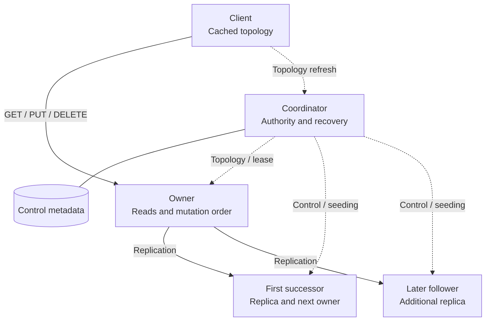
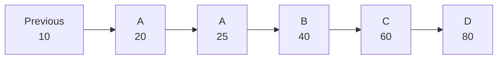
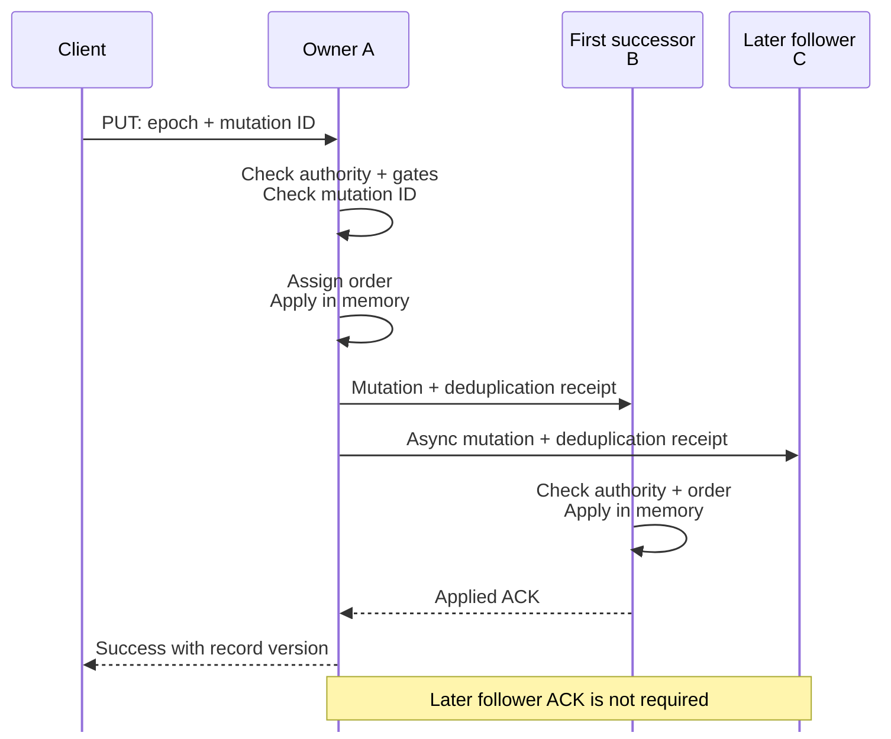
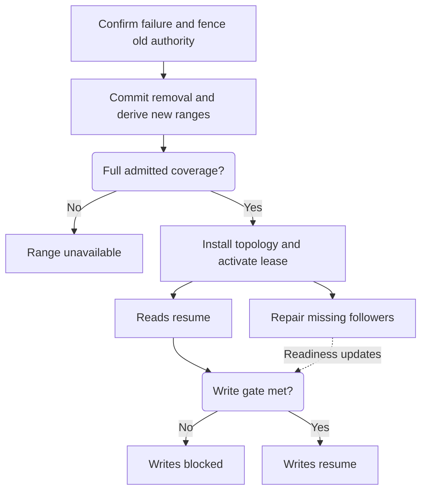
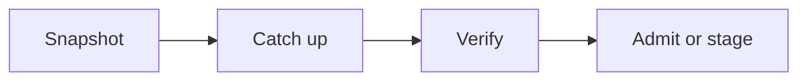
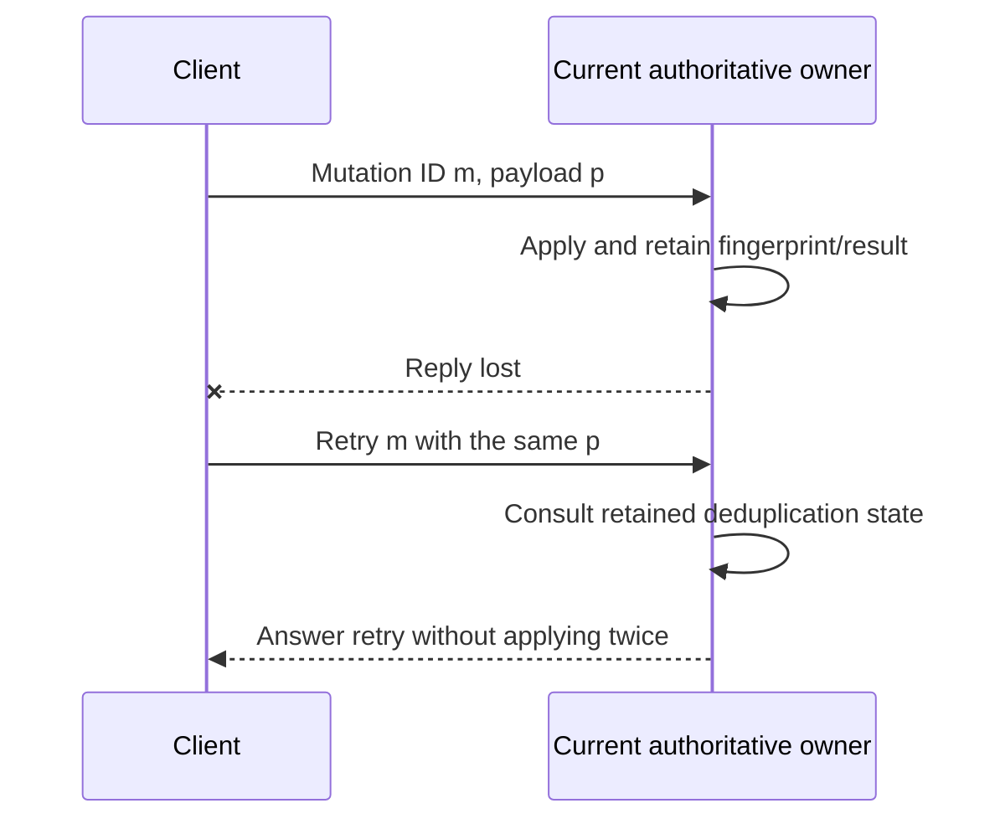

# How the HA cache fits together

This is a presentation companion to [RFC 0001](0001-ha-for-consistent-hash-cache.md). It explains the intended design; it is not an implementation-status report or evidence that the acceptance tests pass. The RFC remains the detailed contract. Its baseline and implementation phases describe the original plan.

**The central idea:** the ring determines where data belongs, the coordinator controls when ownership changes, and verified replicas determine whether the system can safely serve after a change.

Use the eight sections below as a roughly 15-minute walkthrough. Each section has one takeaway to present. Diagrams use Mermaid so they can be reviewed with the prose and rendered in a Mermaid-capable Markdown viewer.

## 1. Three roles, two traffic paths · 2 minutes

**Takeaway: clients contact owners directly; the coordinator manages authority and recovery.**

The diagram follows one range. A physical cache node can own some ranges and follow other owners at the same time.

Solid arrows between clients and cache nodes carry data operations. Dotted arrows represent control interactions; nodes also renew leases with the coordinator. Redb stores control metadata, **not durable cached values**.

| Role | Responsibility | Why it exists |
| --- | --- | --- |
| Client | Derive the owner, route directly, refresh topology, retry within a deadline | Keep the coordinator out of normal data traffic |
| Owner and followers | Apply in-memory records, replicate ordered mutations, seed and verify copies | Separate serving a request from restoring redundancy |
| Singleton coordinator | Serialize topology changes, fence authority, persist admission and recovery work | Give all nodes one committed ownership decision |

The scope is cache-node HA. Coordinator replication and automatic coordinator failover are out of scope. If the coordinator is unavailable, leases eventually expire and nodes stop serving.

Source: [Goal](0001-ha-for-consistent-hash-cache.md#goal), [Thin coordinator](0001-ha-for-consistent-hash-cache.md#1-thin-coordinator).

## 2. Placement also determines failover · 2 minutes

**Takeaway: the first distinct physical successor is both a follower and the natural replacement owner.**

A key hashes to a token. Moving clockwise, the first token owns the key; the next distinct physical nodes are its followers. Virtual-node tokens distribute ownership across physical nodes. Repeated tokens from the same physical node do not count as extra replicas.

Here is a small clockwise slice of a ring, with replication factor (RF) 3:

For a key at token 15, the owner is A and the desired replicas are **A, B, C**. Token 25 belongs to A again, so follower selection skips it.

If A is removed, both its tokens disappear. B becomes the owner of the merged interval `(10, 40]`; the desired replicas become **B, C, D**. B may activate only if its admitted coverage proves that it holds the entire merged interval, including all constituent intervals.

This explains two choices:

- Promotion follows the ring rather than selecting the least-loaded or apparently freshest replica. Routing and recovery use the same placement rule.
- Ranges have topology-relative bounds, not permanent shard identities. Joining nodes split intervals; departing nodes merge them. Readiness must be proved for the resulting bounds.

The slice illustrates one promotion. Across a real vnode ring, different ranges of a failed physical node can move to different successors.

Source: [Ring, ranges, and placement](0001-ha-for-consistent-hash-cache.md#1-ring-ranges-and-placement).

## 3. Belonging, readiness, and authority are separate · 2 minutes

**Takeaway: being listed in the ring does not prove that a node has the data or permission to serve.**

| Question | Mechanism | What it proves |
| --- | --- | --- |
| Where should this range live? | Committed topology: epoch, tokens, RF, policy, guards, digest | Deterministic owner and ordered desired followers |
| Does this copy contain the required history? | Durable admission for exact epoch, bounds, node, and verified watermark | Complete initial coverage and contiguous mutation history |
| Is this follower usable now? | Admission, connection, and configured lag bound | Follower health for the relevant gates |
| May this owner serve now? | Installed topology and valid node/epoch lease, plus fencing | Authority to serve under that epoch |
| May this write succeed now? | Availability guards and ACK policy | Enough eligible copies and required acknowledgements |

For example, D can be a desired follower while still receiving a snapshot. It is not yet admitted and cannot count as a ready replica. An admitted copy can later become disconnected or too far behind to be healthy.

Admission updates do not change the global topology epoch or get sent to clients. This lets replica repair progress without changing routing. Ownership and policy changes do require a committed epoch.

Source: [Committed topology](0001-ha-for-consistent-hash-cache.md#2-committed-topology-contract), [Readiness](0001-ha-for-consistent-hash-cache.md#3-desired-placement-versus-operational-readiness).

## 4. A write policy chooses what success means · 2 minutes

**Takeaway: waiting for the specific promotion target is what connects write acknowledgement to failover safety.**

Every successful ACK means applied to memory. It does not mean persisted to disk. Assuming authority and configured availability guards pass:

| Policy | Required application before success | Cost and failure behavior |
| --- | --- | --- |
| `OwnerOnly` — default | Owner | Does not wait for follower ACKs; recent acknowledged writes can be lost on owner failure |
| `FirstSuccessor` | Owner and the exact first successor | Adds replication wait; acknowledged writes survive one member failure from a healthy starting state |
| `AllReplicas` | Complete desired RF | Waits for every required copy; under-replication blocks writes |

The following sequence shows a successful `FirstSuccessor` write at RF=3, with both followers admitted. The later follower's delivery is independent of the client response.

Why not “any two copies”? If A and C acknowledge while B is behind, the ring still promotes B when A disappears. An arbitrary second ACK would not protect the deterministic promotion path.

Guards are a separate admission decision. Defaults require one admitted copy and zero healthy followers, so a leased `OwnerOnly` owner can write alone. Stricter guards trade availability for reduced loss risk. `AllReplicas` never reinterprets “all” as only the copies that happen to be available.

Source: [Consistency contract](0001-ha-for-consistent-hash-cache.md#5-consistency-contract), [Owner write path](0001-ha-for-consistent-hash-cache.md#2-owner-write-path).

## 5. Failover has two recovery milestones · 2 minutes

**Takeaway: making a replacement safe to read from and making it safe to acknowledge new writes are different steps.**

With `FirstSuccessor`, B may have all acknowledged data when A fails. But once B owns the range, C is B's first successor. If C is behind, B must wait for C to catch up and be admitted before successful writes resume. Otherwise the next acknowledged write would lack the protection the policy promises.

With `OwnerOnly`, writes may resume when the configured guards pass, accepting possible acknowledged-tail loss. With `AllReplicas`, the complete desired RF must be ready; too few remaining members can keep writes blocked until capacity returns.

Fencing prevents two owners from serving conflicting authority. Leases cover `(node_id, topology_epoch)`, and process identity prevents a restarted empty process from inheriting an old instance's authority. GET also requires a valid lease.

One broken link is not enough to identify a failed endpoint. Missing/expired leases can confirm failure; otherwise the design requires corroboration from at least two independent nodes. An ambiguous pairwise failure remains degraded rather than causing arbitrary eviction. The default five-second lease is a fencing parameter, **not a five-second failover SLA**.

Source: [Leases](0001-ha-for-consistent-hash-cache.md#2-owner-leases-and-fencing), [Failure confirmation](0001-ha-for-consistent-hash-cache.md#3-failure-suspicion-and-confirmation), [Failover](0001-ha-for-consistent-hash-cache.md#4-failover).

## 6. Data movement prepares copies before using them · 1 minute

**Takeaway: snapshot, catch-up, and verification provide the evidence needed for a transition.**

| Operation | What changes | Gate before using the result |
| --- | --- | --- |
| Scale-out | New tokens split ranges and change owner/follower obligations | Briefly pause affected writes, drain final changes, verify, satisfy target policy barriers, then commit and activate |
| Graceful scale-in | Removed tokens merge ranges | Prove successor coverage and required downstream readiness; synchronize missing data before cutover |
| Failure removal | Authority moves without cooperation from the failed node | Fence old authority and require surviving admitted coverage; incomplete copies cannot be promoted |
| Replica repair | Missing copies fill in the desired set | Verify snapshot and incremental history before admission; unchanged topology needs no routing epoch bump |
| Stronger ACK policy | More specific copies become required for success | Catch up required copies before committing the stronger policy |

Graceful scale-in can usually reuse replicas instead of copying the owner's whole dataset. Repair still has work after promotion because the desired follower set changes. Repair is bounded and resumable; a topology change can invalidate its epoch or bounds and require replanning.

A returning fenced node rejoins explicitly and is reset and seeded as a new participant. Old records are not proof of readiness.

Source: [Membership and data movement](0001-ha-for-consistent-hash-cache.md#membership-and-data-movement).

## 7. Ordering and retries close different correctness gaps · 2 minutes

**Takeaway: a lost reply must not turn into a duplicate mutation, and a missing replication entry must not disappear unnoticed.**

Two counters answer different questions:

- The record version `(topology_epoch, owner_node_id, owner_sequence)` identifies mutation order on the physical owner.
- A contiguous `stream_sequence` belongs to each `(epoch, owner, follower)` stream. A follower may receive only a subset of the owner's mutations, so the separate counter detects gaps in that follower's delivery.

A gap triggers retained-history catch-up or snapshot repair. Followers do not skip it. A new topology epoch establishes new stream identities and readiness barriers.

For client retries, consider an owner that applies a write but loses its reply:

The client preserves the same mutation ID across refreshes and retries. Deduplication records replicate with mutations so a promoted successor can answer from the history it retained. This does not recover writes lost under `OwnerOnly`.

The receipt retention period is 60 seconds. The guarantee is at-most-once while the receipt is retained, not indefinite exactly-once execution. If the receipt store budget cannot preserve that period, the owner rejects new writes before applying them. Reusing an ID with different content is a conflict.

Errors preserve two independent facts: **why the attempt ended** and **whether the mutation may have applied**. A deadline can expire with `KnownNotApplied` or `MayHaveApplied`; later retry failures cannot erase an earlier uncertain outcome. One end-to-end deadline bounds connection, topology refresh, backoff, and RPC attempts.

Source: [Replication streams](0001-ha-for-consistent-hash-cache.md#1-mutation-ordering-and-replication-streams), [Idempotency](0001-ha-for-consistent-hash-cache.md#3-mutation-idempotency), [Retry semantics](0001-ha-for-consistent-hash-cache.md#4-error-and-retry-semantics).

## 8. End with the guarantees and their limits · 1 minute

**Takeaway: this design makes the availability versus acknowledged-loss tradeoff explicit.**

| Teammate's question | Answer |
| --- | --- |
| Does RF=3 mean every successful write exists on three nodes? | Only `AllReplicas` requires that. RF describes desired placement; the ACK policy defines success. |
| Can a follower answer a normal GET? | No. Reads go to the current leased owner. |
| Is `OwnerOnly` linearizable across failover? | No. Its per-key linearizability promise is within one owner epoch; failover may expose older state. |
| Can we recover from an incomplete copy? | It cannot be promoted without complete admitted coverage. The range remains unavailable. |
| Does durable coordinator metadata make cache data durable? | No. Cached data and its ACKs are in-memory. |
| Does cache-node HA cover coordinator failure? | No. Nodes fail closed when leases expire; coordinator HA is outside scope. |
| How do we explain a blocked range? | Inspect epoch/owner, lease, desired versus admitted copies, stream lag/gaps, active policy, guards, and repair phase. |

For deeper discussion, return to the RFC's [test plan](0001-ha-for-consistent-hash-cache.md#test-plan) and [verification criteria](0001-ha-for-consistent-hash-cache.md#verification). They define the evidence needed to establish the intended guarantees; this walkthrough does not substitute for that evidence.
