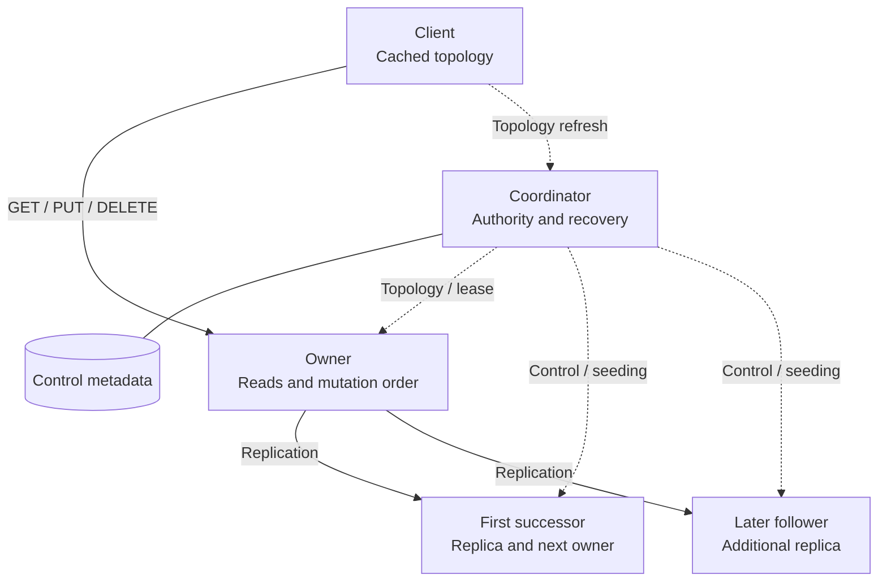
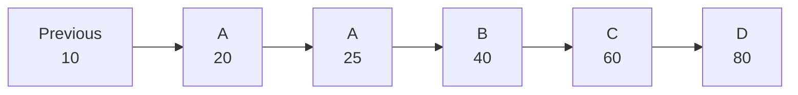
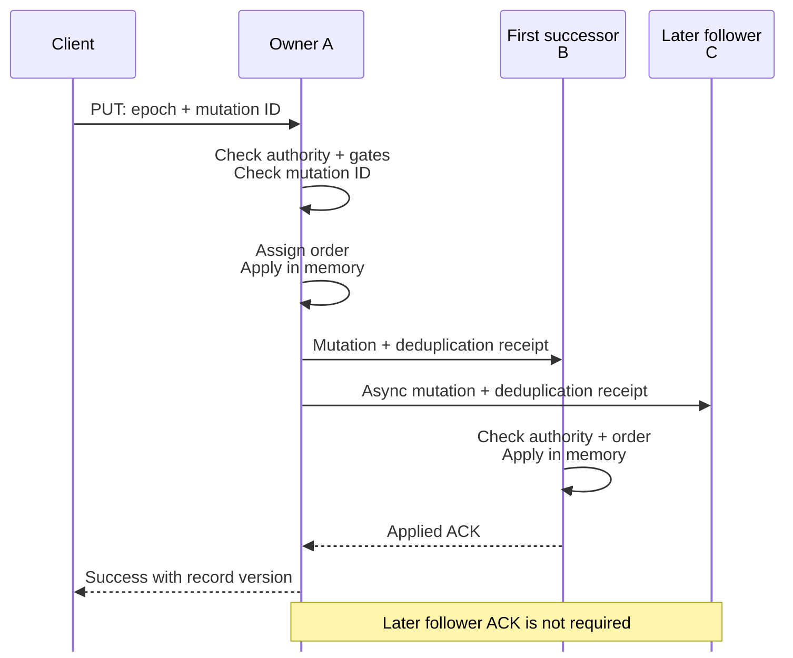
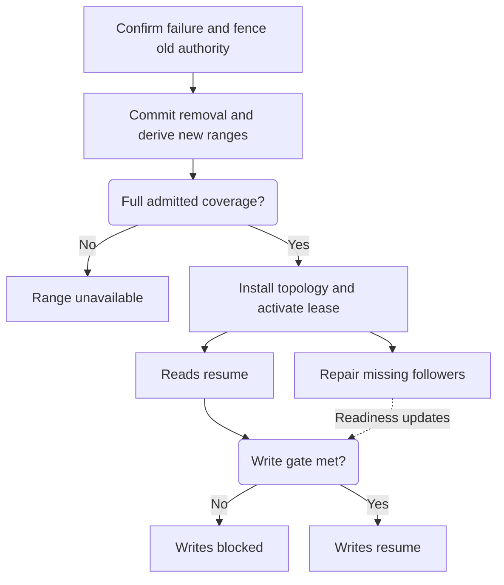
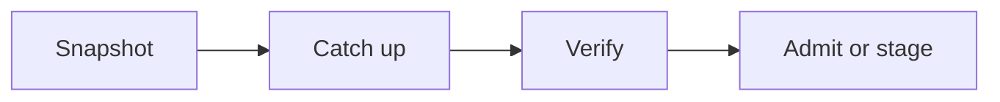
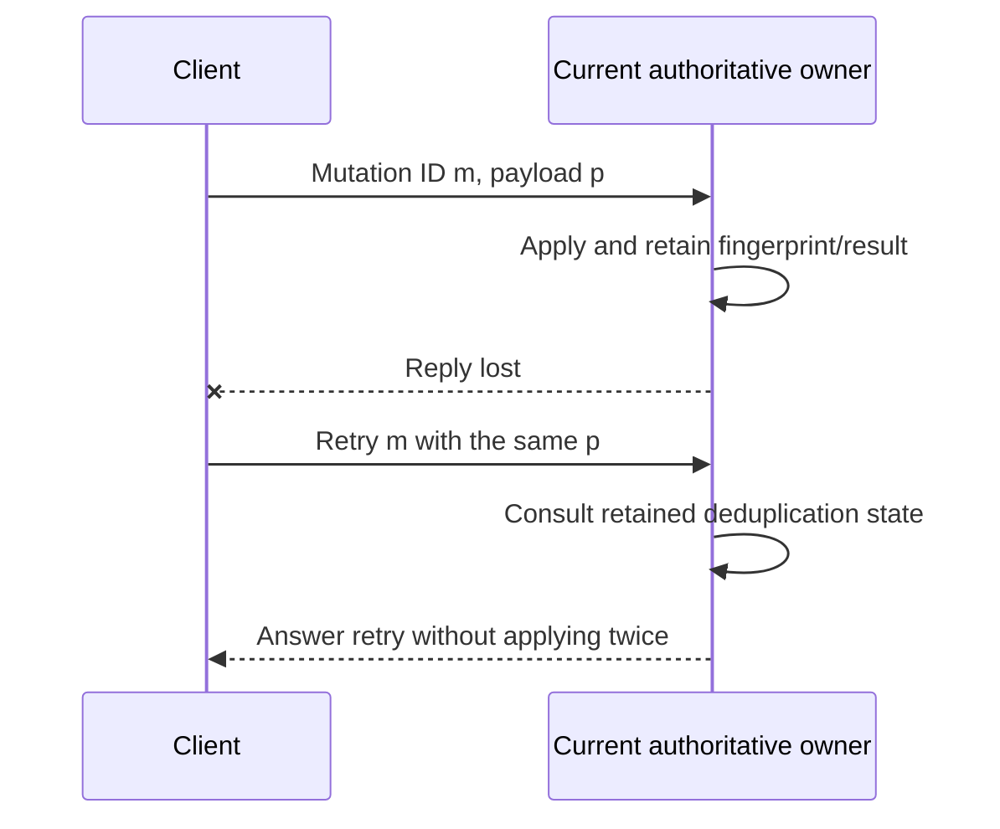

# How the HA cache fits together

This walkthrough accompanies [RFC 0001](0001-ha-for-consistent-hash-cache.md). It explains the intended design. It does not report implementation status, and it is not evidence that the acceptance tests pass. For exact rules, the RFC is the reference. The RFC's baseline and implementation phases describe the original plan.

**The short version:** the ring decides where data belongs. The coordinator decides when ownership changes. Verified replicas decide whether the system can serve safely after a change.

The eight sections take about 15 minutes to present, and each one has a single takeaway. The diagrams are Mermaid, so any Mermaid-capable Markdown viewer renders them.

## 1. Three roles, two traffic paths · 2 minutes

**Takeaway: clients talk to owners directly. The coordinator handles authority and recovery.**

The diagram shows a single range. In practice every cache node owns some ranges and follows other owners for other ranges.

```mermaid
%%{init: {"flowchart": {"rankSpacing": 65}}}%%
flowchart TB
    C["Client<br/>Cached topology"]
    K["Coordinator<br/>Authority and recovery"]
    M[(Control metadata)]
    O["Owner<br/>Reads and mutation order"]
    F1["First successor<br/>Replica and next owner"]
    F2["Later follower<br/>Additional replica"]
    C -->|GET / PUT / DELETE| O
    C -.->|Topology refresh| K
    K --- M
    K -.->|Topology / lease| O
    K -.->|Control / seeding| F1
    K -.->|Control / seeding| F2
    O -->|Replication| F1
    O -->|Replication| F2
```

Solid arrows are data traffic. Dotted arrows are control traffic, which also includes nodes renewing their leases. Redb stores control metadata only. Cached values are never written to disk.

| Role | What it does | Why it is separate |
| --- | --- | --- |
| Client | Computes the owner, sends requests to it, refreshes topology, retries until a deadline | Keeps the coordinator off the data path |
| Owner and followers | Apply records in memory, replicate mutations in order, seed and verify copies | Serving requests and restoring redundancy are different jobs |
| Coordinator (single instance) | Serializes topology changes, fences old owners, persists admission and recovery work | Every node needs the same answer about who owns what |

This design covers cache-node HA only. The coordinator is not replicated and does not fail over. If it goes down, leases expire and nodes stop serving.

Source: [Goal](0001-ha-for-consistent-hash-cache.md#goal), [Thin coordinator](0001-ha-for-consistent-hash-cache.md#1-thin-coordinator).

## 2. Placement also decides failover · 2 minutes

**Takeaway: the first distinct physical successor is a follower now and the replacement owner later.**

A key hashes to a token. Walking clockwise, the first token's node owns the key, and the next distinct physical nodes are its followers. Virtual-node tokens spread ownership across the physical nodes. A second token from a node that is already in the set does not add a replica.

Here is a small clockwise slice of a ring, with replication factor (RF) 3:

```mermaid
flowchart LR
    P["Previous<br/>10"] --> A1["A<br/>20"]
    A1 --> A2["A<br/>25"]
    A2 --> B["B<br/>40"]
    B --> C["C<br/>60"]
    C --> D["D<br/>80"]
```

A key at token 15 is owned by A, and its desired replicas are **A, B, C**. Token 25 also belongs to A, so follower selection skips it.

Now remove A. Both of its tokens disappear, and B owns the merged interval `(10, 40]`. The desired replicas become **B, C, D**. B can take over only if its admitted coverage includes the whole merged interval, not just the part it followed before.

Two design choices follow from this:

- Promotion follows the ring. It does not pick the least-loaded replica or the one that looks most up to date, so routing and recovery use the same rule.
- Ranges are defined by their bounds in the current topology. They have no permanent shard ID. A joining node splits intervals, and a departing node merges them. Readiness has to be proved for whatever bounds result.

This slice shows one promotion. In a real ring with many vnodes, the ranges of a failed node move to several different successors.

Source: [Ring, ranges, and placement](0001-ha-for-consistent-hash-cache.md#1-ring-ranges-and-placement).

## 3. Placement, readiness, and authority are separate · 2 minutes

**Takeaway: a node listed in the ring may not have the data yet, and may not be allowed to serve.**

| Question | Answered by | What it establishes |
| --- | --- | --- |
| Where should this range live? | Committed topology: epoch, tokens, RF, policy, guards, digest | The owner and the ordered list of desired followers |
| Does this copy have the full history? | Durable admission record for an exact epoch, range, node, and verified watermark | The copy has all initial data and a contiguous mutation history |
| Can this follower be counted on right now? | Admission, a live connection, and lag within the configured bound | The follower is healthy for the write gates |
| May this owner serve right now? | Installed topology, a valid lease for the node and epoch, and fencing | The owner has authority for this epoch |
| May this write succeed right now? | Availability guards and the ACK policy | Enough eligible copies exist and the required ACKs arrived |

For example, D can be a desired follower while its snapshot is still arriving. Until D is admitted, it does not count as a replica. An admitted copy can also drop out later if it disconnects or falls too far behind.

Admission changes do not bump the topology epoch, and clients never see them. Repair can therefore make progress without disturbing routing. Changes to ownership or policy do require a new committed epoch.

Source: [Committed topology](0001-ha-for-consistent-hash-cache.md#2-committed-topology-contract), [Readiness](0001-ha-for-consistent-hash-cache.md#3-desired-placement-versus-operational-readiness).

## 4. The write policy defines success · 2 minutes

**Takeaway: waiting for the node that would be promoted is what makes an ACK survive failover.**

An ACK always means the mutation was applied in memory, never that it reached disk. Assuming the owner has authority and the guards pass:

| Policy | Must apply before success | Cost and failure behavior |
| --- | --- | --- |
| `OwnerOnly` (default) | Owner | No follower wait. If the owner fails, recent acknowledged writes can be lost |
| `FirstSuccessor` | Owner and the first successor | One replication round trip. From a healthy state, acknowledged writes survive any single failure |
| `AllReplicas` | Every node in the desired replica set | Waits for every copy. Writes stop while the range is under-replicated |

Here is a successful `FirstSuccessor` write at RF=3 with both followers admitted. The client gets its response without waiting for the later follower.

```mermaid
%%{init: {"sequence": {"actorMargin": 20, "width": 120, "diagramMarginX": 10, "mirrorActors": false, "messageMargin": 25}}}%%
sequenceDiagram
    participant C as Client
    participant O as Owner A
    participant B as First successor<br/>B
    participant F as Later follower<br/>C
    C->>O: PUT: epoch + mutation ID
    O->>O: Check authority + gates<br/>Check mutation ID
    O->>O: Assign order<br/>Apply in memory
    O->>B: Mutation + deduplication receipt
    O->>F: Async mutation + deduplication receipt
    B->>B: Check authority + order<br/>Apply in memory
    B-->>O: Applied ACK
    O-->>C: Success with record version
    Note over O,F: Later follower ACK is not required
```

Why not accept any two copies? Suppose A and C acknowledge while B lags. If A then fails, the ring still promotes B, and B is missing the write. A second ACK only helps if it comes from B.

Guards are a separate check that runs before the write. By default they require one admitted copy and zero healthy followers, so a leased `OwnerOnly` owner can accept writes on its own. Stricter guards give up some availability to reduce the chance of loss. `AllReplicas` always means the full desired set, never just the copies that happen to be up.

Source: [Consistency contract](0001-ha-for-consistent-hash-cache.md#5-consistency-contract), [Owner write path](0001-ha-for-consistent-hash-cache.md#2-owner-write-path).

## 5. Reads and writes recover at different times · 2 minutes

**Takeaway: a new owner can serve reads before it is allowed to acknowledge writes.**

```mermaid
%%{init: {"flowchart": {"rankSpacing": 25, "nodeSpacing": 25}}}%%
flowchart TD
    A["Confirm failure and fence old authority"] --> B["Commit removal and derive new ranges"]
    B --> C("Full admitted coverage?")
    C -->|No| U[Range unavailable]
    C -->|Yes| D["Install topology and activate lease"]
    D --> E[Reads resume]
    D --> F[Repair missing followers]
    E --> G("Write gate met?")
    F -.->|Readiness updates| G
    G -->|No| H[Writes blocked]
    G -->|Yes| I[Writes resume]
```

Under `FirstSuccessor`, B may hold every acknowledged write when A fails. Once B owns the range, though, C becomes B's first successor. If C is behind, B has to wait for C to catch up and be admitted before writes can succeed again. Otherwise the next acknowledged write would have no protected copy.

Under `OwnerOnly`, writes resume as soon as the guards pass, and some recently acknowledged writes may already be gone. Under `AllReplicas`, every desired copy must be ready. If too few members remain, writes stay blocked until capacity comes back.

Fencing stops two owners from serving the same range. A lease covers `(node_id, topology_epoch)`, and the process-instance ID means a restarted process with empty memory cannot pick up the old instance's authority. GET needs a valid lease too.

A single broken link does not say which end has failed. A missing or expired lease is enough to confirm a failure. Otherwise at least two independent nodes must report the member unreachable. If only one pair of nodes disagrees, the affected ranges stay degraded and nobody is evicted. The default lease is five seconds, but that is a fencing parameter. It is **not a five-second failover target**.

Source: [Leases](0001-ha-for-consistent-hash-cache.md#2-owner-leases-and-fencing), [Failure confirmation](0001-ha-for-consistent-hash-cache.md#3-failure-suspicion-and-confirmation), [Failover](0001-ha-for-consistent-hash-cache.md#4-failover).

## 6. Copies are verified before they are used · 1 minute

**Takeaway: every transition waits for a copy that has been snapshotted, caught up, and verified.**

```mermaid
flowchart LR
    S[Snapshot] --> L[Catch up]
    L --> V[Verify]
    V --> R[Admit or stage]
```

| Operation | What changes | What must hold before the result is used |
| --- | --- | --- |
| Scale-out | New tokens split ranges and add owner and follower duties | Pause affected writes briefly, drain the last changes, verify, meet the target policy, then commit and activate |
| Graceful scale-in | Removed tokens merge ranges | Successors cover the merged ranges and downstream followers are ready. Missing data is synced before cutover |
| Failure removal | Ownership moves without help from the failed node | Old authority is fenced and a surviving admitted copy covers each range. Incomplete copies are not promoted |
| Replica repair | Missing copies are filled in | Snapshot and incremental history are verified before admission. The topology epoch does not change |
| Stronger ACK policy | More copies become required for success | Those copies catch up before the stronger policy is committed |

A graceful scale-in can usually reuse existing replicas instead of copying the owner's whole dataset. Repair still has work to do after a promotion, because the desired follower set shifts. Repair is bounded and resumable. If the topology changes under it, the task's epoch or bounds may no longer match, and it is re-planned.

A node that was fenced and comes back must rejoin explicitly. It is reset and seeded like a brand-new node. The records it still holds prove nothing.

Source: [Membership and data movement](0001-ha-for-consistent-hash-cache.md#membership-and-data-movement).

## 7. Ordering and retries solve different problems · 2 minutes

**Takeaway: a lost reply must not cause a duplicate write, and a missing replication entry must not go unnoticed.**

There are two counters, and they do different jobs:

- The record version `(topology_epoch, owner_node_id, owner_sequence)` orders mutations on the physical owner.
- Each `(epoch, owner, follower)` stream has its own contiguous `stream_sequence`. A follower receives only the mutations for ranges it replicates, so it needs its own counter to spot gaps.

When a follower sees a gap, it catches up from retained history or from a snapshot. It never skips the gap. A new topology epoch starts new streams and new readiness checks.

Retries cover a different failure. Say the owner applies a write, but the reply never reaches the client:

```mermaid
sequenceDiagram
    participant C as Client
    participant O as Current authoritative owner
    C->>O: Mutation ID m, payload p
    O->>O: Apply and retain fingerprint/result
    O--xC: Reply lost
    C->>O: Retry m with the same p
    O->>O: Consult retained deduplication state
    O-->>C: Answer retry without applying twice
```

The client keeps the same mutation ID across refreshes and retries. Deduplication receipts replicate along with mutations, so a promoted successor can answer a retry from what it received. This does not bring back writes that `OwnerOnly` lost.

Receipts are kept for 60 seconds. Within that window a mutation runs at most once. There is no exactly-once guarantee beyond it. If the receipt store runs out of budget, the owner rejects new writes before applying them rather than evict receipts early. Reusing an ID with different content is a conflict.

Each error carries two separate facts: **why the attempt stopped** and **whether the mutation might have been applied**. A deadline can expire with either `KnownNotApplied` or `MayHaveApplied`. Once an outcome is uncertain, later retry failures cannot turn it back into a known one. A single end-to-end deadline covers connecting, topology refresh, backoff, and every RPC attempt.

Source: [Replication streams](0001-ha-for-consistent-hash-cache.md#1-mutation-ordering-and-replication-streams), [Idempotency](0001-ha-for-consistent-hash-cache.md#3-mutation-idempotency), [Retry semantics](0001-ha-for-consistent-hash-cache.md#4-error-and-retry-semantics).

## 8. Guarantees and limits · 1 minute

**Takeaway: the design makes you choose between write availability and the risk of losing acknowledged writes, and states which one you chose.**

| Question you will probably get | Answer |
| --- | --- |
| Does RF=3 mean every successful write is on three nodes? | Only under `AllReplicas`. RF says where copies should live. The ACK policy says what success means. |
| Can a follower answer a normal GET? | No. Reads go to the current leased owner. |
| Is `OwnerOnly` linearizable across failover? | No. Per-key linearizability holds within one owner epoch. After failover, clients may see older state. |
| Can we recover from an incomplete copy? | No. It cannot be promoted without complete admitted coverage, so the range stays unavailable. |
| Does durable coordinator metadata make cached data durable? | No. Cached data and its ACKs live in memory. |
| Does cache-node HA cover coordinator failure? | No. Nodes stop serving when their leases expire. Coordinator HA is out of scope. |
| How do we explain why a range is blocked? | Check the epoch and owner, the lease, desired versus admitted copies, stream lag and gaps, the active policy, the guards, and the repair phase. |

For more depth, see the RFC's [test plan](0001-ha-for-consistent-hash-cache.md#test-plan) and [verification criteria](0001-ha-for-consistent-hash-cache.md#verification). They define the evidence the guarantees depend on. This walkthrough is not that evidence.
